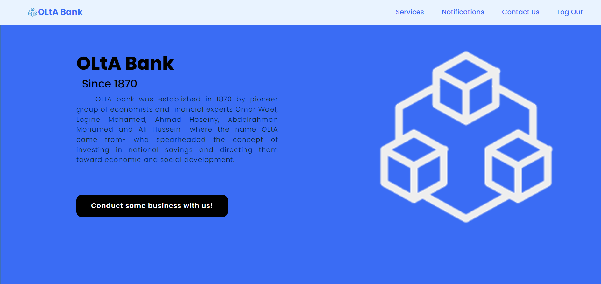
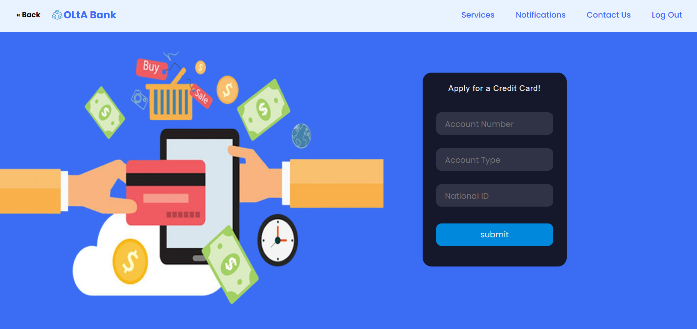
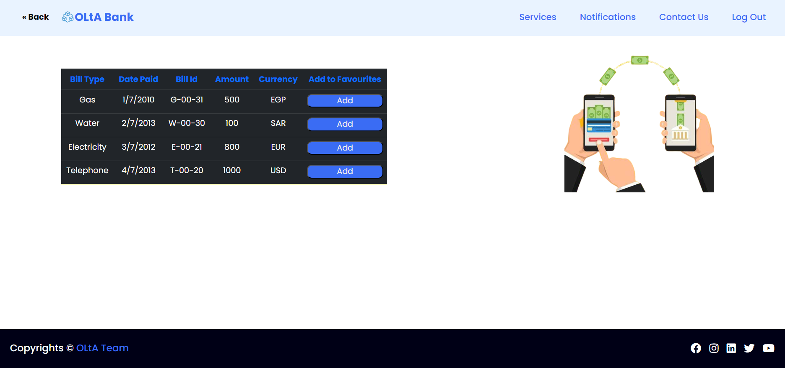
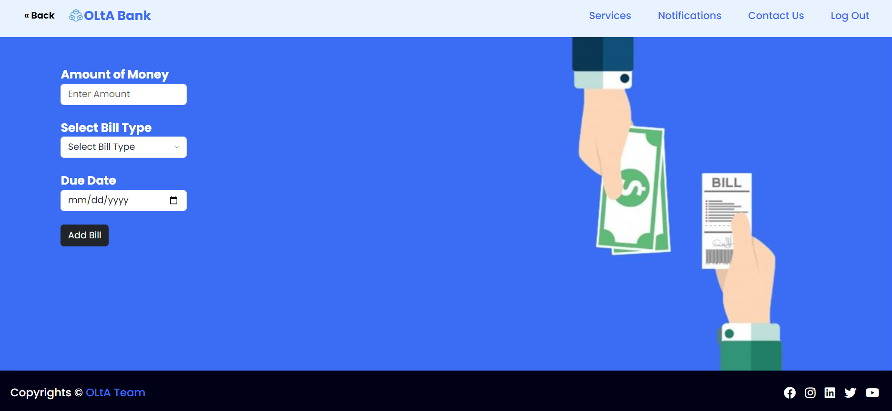
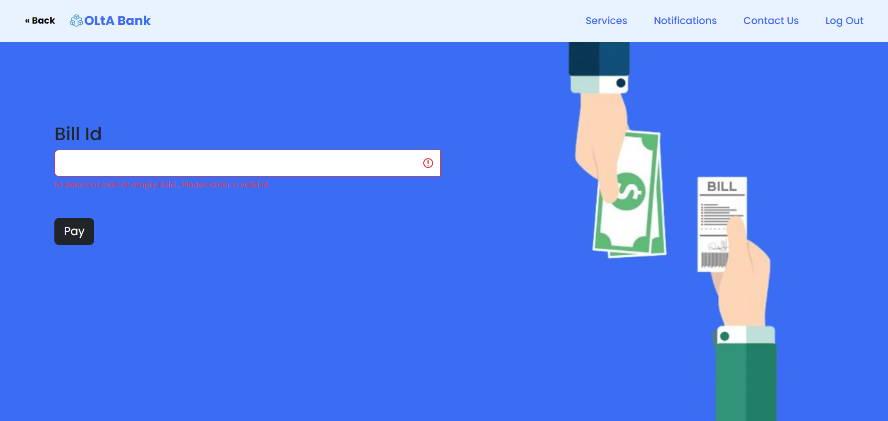
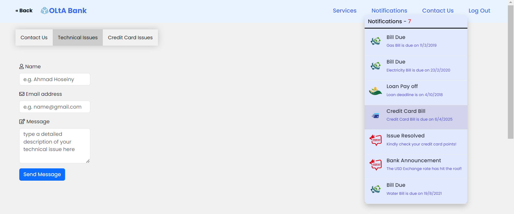
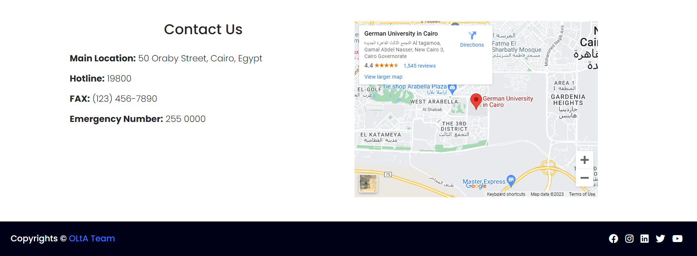
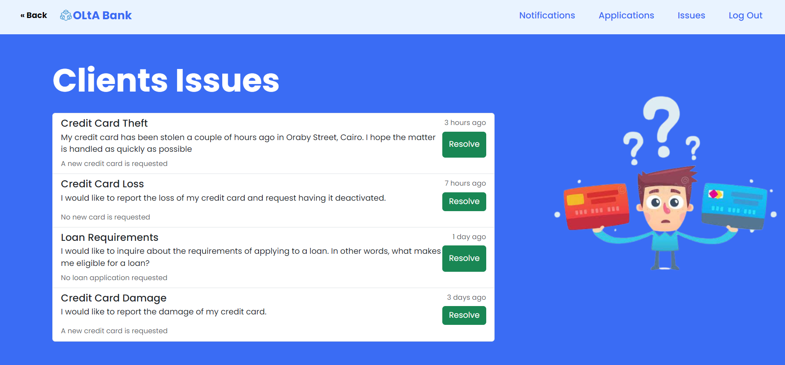

#  <span style="color:#53a2f6">OLtA Bank</span>

This project is a frontend only website of the online banking system of **OLtA Bank**.

The system provides its servies to three types of users:

* Client

        A client can register, login with his/her credentials,
        navigate through the entire website, preform basic CRUD 
        operations on his/her accounts, credi cards, loans, etc,
        and contact the bank for various types of issues 
* Banker

        A banker can login with his/her credential, view 
        his/her performance review and view the clients'
        banking issues to resolve them.
* Admin

        An admin can also login, view performance reviews,
        make announcements and view the clients' technical
        issues to resolve them.

and it also handles accessibility issues where visually impaired clients can still use the website.

___

# Installation

1. clone the project from github.
    ```bash
        git clone https://github.com/software-engineering-2023/Uncle-Bob-s-Descendants-.git 
    ```
2. Open the *login.html* file using Google Chrome and start navigating the website

3. The following are the login credentials used for testing purposes:

    | Email          | Password       |
    | :------------: | :------------: |
    | client@g.com   | client123      |
    | banker@g.com   | banker123      |
    | admin@g.com    | admin123       |

# Screenshots

## Home Page
#  

## Credit Card Application
#  

## View Bills
#  

## Add Bill
#  

## Pay Bill
#  

## Complaints & Notifications
#  

## Contact Us
#  

## Issues
# 

# Contributors
This project has been implemented by a team of five computer engineering students

* [Ahmad Hoseiny](https://github.com/AhmadHoseiny)
* [Omar Wael](https://github.com/o-wael)
* [Abdelrahman Salah](https://github.com/19AbdelrahmanSalah19)
* [Ali Hussein](https://github.com/AliAdam102002)
* [Logine Mohamed](https://github.com/logine20)